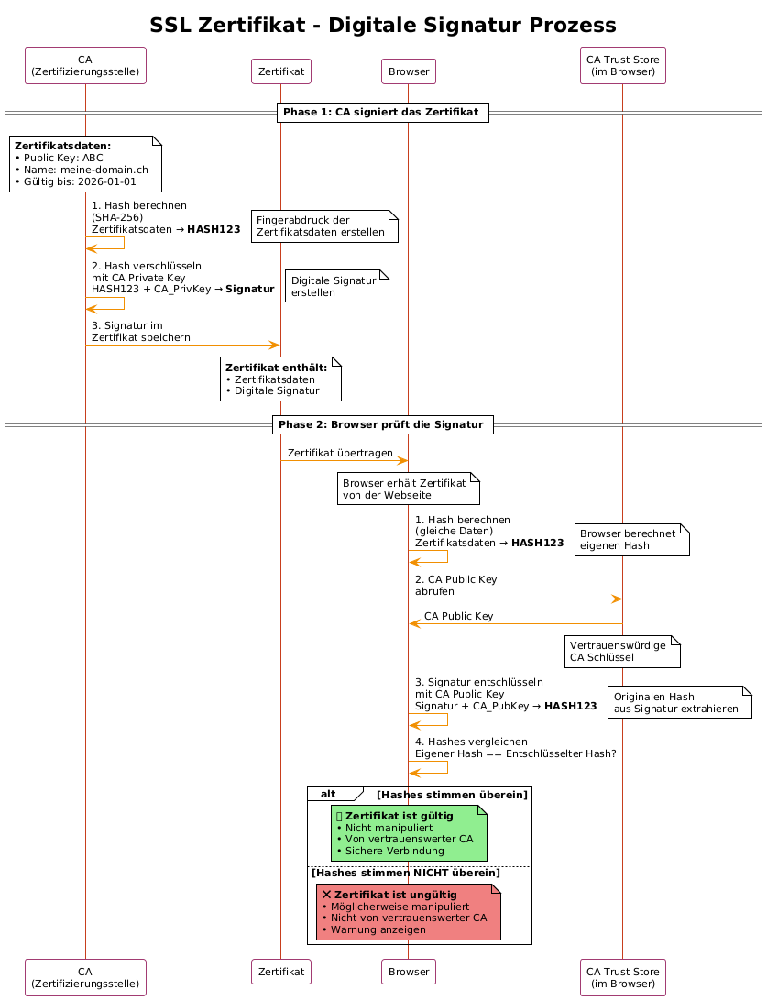

# zertifikate-uebung
**Bewertete Übung @Oli**

SSL Zertifikate allgemein:
- können auch selbst erstellt werden, diese sind dann "self-signed" und werden vielleicht nicht von jedem Browser akzeptiert oder die User werden gewarnt dass zu dem Zertifikat keine vertrauenswürdige CA existiert.
- self-signed zertifikate sind eher für testumgebungen zu verwenden

Ein  "echtes" Zertifikat muss man bei einer Zertifizierungsstelle kaufen oder ein kostenloses von Let's Encrypt verwenden.

# Zertifikat selbst erstellen
## Voraussetzungen
OpenSSL: Du benötigst OpenSSL, ein Open-Source-Tool für die Erstellung und Verwaltung von Zertifikaten. Unter Linux ist es meistens vorinstalliert, unter Windows musst du es eventuell installieren.

## Schritte
- Private Key erstellen: 
Öffne eine Kommandozeile (Terminal oder Eingabeaufforderung) und gib folgenden Befehl ein:
```
openssl genrsa -out meinzertifikat.key 2048
```

Dieser Befehl erstellt einen privaten Schlüssel namens meinzertifikat.key mit einer Länge von 2048 Bit.

- Certificate Signing Request (CSR) erstellen: 
Gib folgenden Befehl ein:
```
openssl req -new -key meinzertifikat.key -out meinzertifikat.csr
```

Du wirst nach einigen Informationen gefragt:

- Country Name (2 letter code): Ländercode (z.B. CH für Schweiz)
- State or Province Name (full name): Kanton (z.B. Zürich)
- Locality Name (eg, city): Stadt (z.B. Zürich)
- Organization Name (eg, Company): Name deiner Organisation oder deines Projekts
- Organizational Unit Name (eg, Department): Abteilung (optional)
- Common Name (eg, your domain name): Dein Domainname (z.B. meine-domain.ch oder localhost für lokale Entwicklung)
Email Address: Deine E-Mail-Adresse
- A challenge password: Optionales Passwort
- An optional company name: Optionaler Firmenname

Diese Informationen werden im Zertifikat gespeichert. Der "Common Name" ist besonders wichtig, da er mit dem Domainnamen übereinstimmen muss, für den das Zertifikat gültig sein soll.

Selbstsigniertes Zertifikat erstellen: 
```
openssl x509 -req -days 365 -in meinzertifikat.csr -signkey meinzertifikat.key -out meinzertifikat.crt
```

Dieser Befehl erstellt ein selbstsigniertes Zertifikat namens meinzertifikat.crt, das für 365 Tage gültig ist. Du kannst die Gültigkeitsdauer anpassen, indem du den Wert -days änderst.

## Dateien
Nach diesen Schritten hast du drei Dateien:

- **meinzertifikat.key**: Dein privater Schlüssel.
- **meinzertifikat.csr**: Die Certificate Signing Request (wird für selbstsignierte Zertifikate nicht benötigt, kann aber nützlich sein, wenn du später ein "echtes" Zertifikat beantragen möchtest).
- **meinzertifikat.crt**: Dein selbstsigniertes Zertifikat.

**Verwendung**

Du kannst nun meinzertifikat.key und meinzertifikat.crt verwenden, um SSL für deinen Webserver zu aktivieren. Die genaue Vorgehensweise hängt von deinem Webserver ab (z.B. Apache, Nginx).

**Warnung**

Wie gesagt, Browser werden dieses Zertifikat nicht automatisch als vertrauenswürdig einstufen. Du musst es entweder manuell in den Browser importieren (was für Besucher deiner Webseite keine praktikable Lösung ist) oder die Warnmeldung ignorieren (was nur für Testzwecke akzeptabel ist).


## Zertifizierungsstellen wo man "richtige" Zertifikate kaufen kann
- swissign.com
- QuoVadisglobal.com
- globalsign.com

## Zertifikatstypen
- Domain Validated (DV): Die einfachste und günstigste Option. Hier wird nur die Kontrolle über die Domain überprüft.
- Organization Validated (OV): Hier wird zusätzlich die Organisation validiert, was mehr Vertrauen schafft.
- Extended Validation (EV): Die höchste Sicherheitsstufe. Hier wird die Organisation sehr gründlich geprüft, und der Browser zeigt den Firmennamen in der Adressleiste an.

## Typische Preise
- DV-Zertifikate: Kostenlose Optionen (z.B. Let's Encrypt) oder ca. 5-50 CHF pro Jahr.
- OV-Zertifikate: Ca. 50-200 CHF pro Jahr.
- EV-Zertifikate: Ca. 100-500 CHF pro Jahr.


Okay, lass uns die Verschlüsselungstechnik dahinter und die Rolle der Schlüssel genauer anschauen.

### Verschlüsselungstechnik

Die Verschlüsselung, die bei SSL/TLS (und damit auch bei HTTPS) verwendet wird, nennt man asymmetrische Verschlüsselung oder Public-Key-Kryptographie. Das Grundprinzip ist, dass es zwei Schlüssel gibt:

*   **Public Key (Öffentlicher Schlüssel):** Dieser Schlüssel kann öffentlich verteilt werden. Jeder kann ihn verwenden, um Daten zu verschlüsseln.
*   **Private Key (Privater Schlüssel):** Dieser Schlüssel muss geheim gehalten werden. Nur der Besitzer des Schlüssels kann damit Daten entschlüsseln, die mit dem zugehörigen Public Key verschlüsselt wurden.

**Wie funktioniert das bei SSL/TLS?**

1.  **Der Client (z.B. dein Browser) verbindet sich mit dem Server (z.B. einer Webseite).**
2.  **Der Server schickt sein Zertifikat an den Client.** Das Zertifikat enthält den Public Key des Servers.
3.  **Der Client überprüft das Zertifikat.** Er prüft, ob das Zertifikat von einer vertrauenswürdigen Zertifizierungsstelle (CA) ausgestellt wurde und ob der Domainname im Zertifikat mit dem Domainnamen der Webseite übereinstimmt.
4.  **Der Client generiert einen Session Key (Sitzungsschlüssel).** Das ist ein zufälliger Schlüssel, der für die symmetrische Verschlüsselung verwendet wird (symmetrische Verschlüsselung ist schneller als asymmetrische).
5.  **Der Client verschlüsselt den Session Key mit dem Public Key des Servers.**
6.  **Der Client schickt den verschlüsselten Session Key an den Server.**
7.  **Der Server entschlüsselt den Session Key mit seinem Private Key.**
8.  **Ab jetzt verwenden Client und Server den Session Key, um alle weiteren Daten symmetrisch zu verschlüsseln.**

### Wozu braucht es `meinzertifikat.key`?

`meinzertifikat.key` ist dein **privater Schlüssel**. Er ist absolut notwendig, um die Daten zu entschlüsseln, die mit dem zugehörigen Public Key verschlüsselt wurden. In unserem Beispiel oben braucht der Server den privaten Schlüssel, um den Session Key zu entschlüsseln, den der Client geschickt hat. Ohne den privaten Schlüssel kann der Server die verschlüsselte Kommunikation nicht entschlüsseln und somit keine sichere Verbindung herstellen.

**Wichtig:** Der private Schlüssel muss geheim gehalten werden. Wenn jemand Zugriff auf deinen privaten Schlüssel hat, kann er den gesamten verschlüsselten Datenverkehr entschlüsseln und sich als dein Server ausgeben.

### Wo ist die Datei mit dem Public Key?

Der Public Key ist **im Zertifikat enthalten** (`meinzertifikat.crt`). Das Zertifikat ist im Grunde eine Art Container, der den Public Key und einige zusätzliche Informationen (z.B. den Domainnamen, für den das Zertifikat gültig ist, und die Informationen über die Zertifizierungsstelle, die das Zertifikat ausgestellt hat) enthält.

Wenn ein Client (z.B. ein Browser) eine Verbindung zu deinem Server herstellt, schickt der Server das Zertifikat an den Client. Der Client extrahiert dann den Public Key aus dem Zertifikat und verwendet ihn, um die Kommunikation zu verschlüsseln.

**Zusammenfassend:**

*   `meinzertifikat.key`: Privater Schlüssel (geheim halten!)
*   `meinzertifikat.crt`: Zertifikat, das den Public Key enthält (kann öffentlich verteilt werden)


## Wie wird geprüft ob das Zertifikat echt ist?

